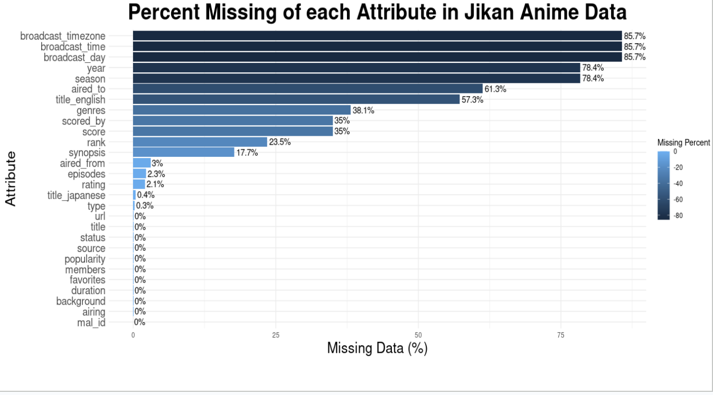
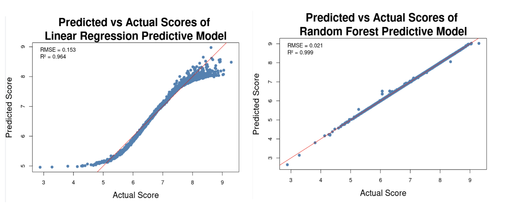

------------------------------------------------------------------------\newpage

# Anime Statistics and Analysis Platform (ASAP)

*Authors: Qiran Hu (qiranhu2), Zoey Yao (wanjing4)*

From Subculture To Mainstream: Examining Anime’s Transformation From Microculture Into Global Mainstream Through User Engagements

The anime culture has become a global phenomenon that significantly influences popular culture and shapes the entertainment industry worldwide with skyrocketed revenues and unprecedented international growth in recent years.

This research examines the key factors of anime’s global market expansion through “anime content creations and distributions” and analyzes their implications for stakeholders and investors as well as regular anime fans.

-   **Improving Anime Fan Experience**\
-   **Current Obstacles With Anime Market**\
-   **Improving Industry Stakeholders Experience**

------------------------------------------------------------------------\newpage

# Data Preprocessing

Handling Missing Values

-   NA rows were removed

-   A lot of data

Predictive Model Data Preprocessing

-   **Producer:** split individual, criteria

-   **Studios:** criteria

-   **Type:** ANOVA, Tukey Test, criteria

-   **Genres:** encodes top 10 with one-hot encoding

-   **Ratings:** ANOVA, Tukey Test, criteria

{width="50%"}

------------------------------------------------------------------------\newpage

# Predictive Model **Training, Validation, and Testing Set**

```         
→ 10‐fold Cross Validation 
```

Linear Regression Model

-   Linearly predicts the score by giving different weights to predictors\

-   Shows a sigmoid shape when plotting

Random Forest

-   Multiple decision trees contribute to the model

-   Almost perfect alignment

{width="50%"}

------------------------------------------------------------------------\newpage

# Future Plans And Set Ups

As the global anime market continues its expansion, our proposed platform offers various benefits to both anime fans and stakeholders. However, as entertainment technology and consumer behavior rapidly evolve, we hope to extend our research to improve the user experience and address specific limitations in our current platform.

-   Large Language Model Integration And Machine Learning Algorithms\

-   Multimedia Performance Evaluation\

-   User-Contributed Database\

-   Global Expansion And Creator Support\

-   Live Event Integration And Virtual Conventions

Set Ups

Running Our Application Locally

Clone the repository located at\
<https://github.com/illinois-stat447/sp25-prj-qiranhu2-wanjing4>.\
With the `app.R` file still open in RStudio, click the **Run App** button (the green ▶️ icon at the top of the source editor).

Using Online Version

If you prefer not to install anything, you can access the Anime Statistics and Analysis Platform directly in your web browser:\
<https://qiranhu.shinyapps.io/AnimeStatisticsandAnalysisPlatform/>

------------------------------------------------------------------------\
